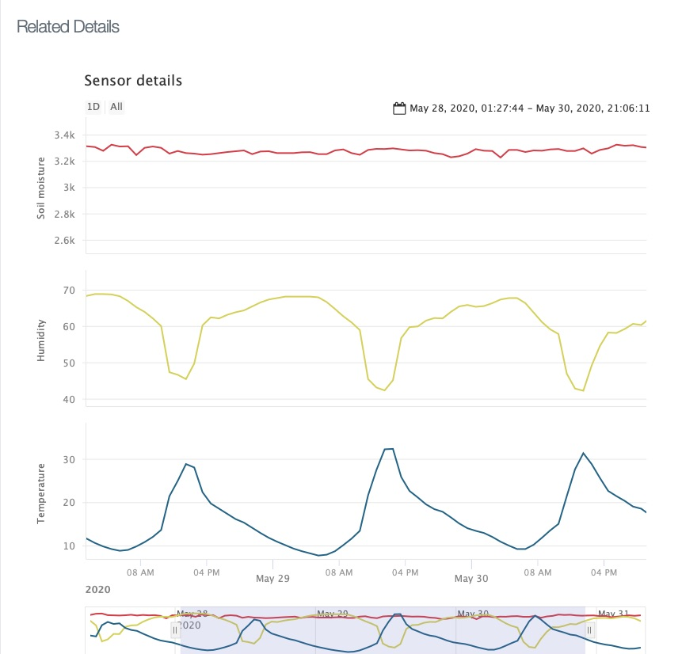

# nodigBackend: Backend to Store and Visualize Observation Data of Vegetable Beds

Authors: Simon Bogutzky

License: [MIT](https://opensource.org/licenses/MIT) 

From License excluded: The source code of trail version of FusionCharts.

Version: 1.2.1

Document version: 1.0.0 

Date: 31/05/2020 

## What is the nodig Backend?

This server software is programmed with the [CakePHP framework](https://cakephp.org). It stores and visualizes the observation data of vegetable beds (see [nodig Firmware](https://github.com/sbogutzky/nodigFirmware-esp32/)).

*Observation Data*

## Author and Contribution
As expressed by license, this is free software published by Simon Bogutzky. The author (Simon Bogutzky) welcomes external contributors to freely use and extend this software. If you need help, please write an [issue](https://github.com/sbogutzky/nodig-backend/issues).